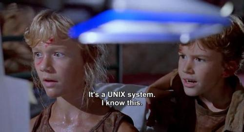

# UNIX for Programmers & Non-Programmers
## 

This repo is a collection of information from my CSC 3320 course - System-Level Programming. It includes shell scripts, class slides, cheat sheets, and more! Scripts I've written include bourne shell (sh), bourne again shell (bash), awk and sed commands.

The purpose of this repo is to help curious minds learn & understand the UNIX operating system, how to use the terminal, basic terminal utilities and utilities for power users and non-programmers. It includes practice docs and dummy data files to practice. Enjoy! :)

## [Scripting](Practice/scripting/)

* [awk](Practice/scripting/awk) - AWK is a special-purpose programming language designed for text processing and typically used as a data extraction and reporting tool. It is a standard feature of most Unix-like operating systems.

* [sed](Practice/scripting/sed) - SED (stand for **S**tream **ED**itor) is a Unix utility that parses and transforms text, using a simple, compact programming language. 

* [bash](Practice/scripting/bash) - BASH (stand for **B**ourne **A**gain **SH**ell) is a Unix shell and command language written by Brian Fox for the GNU Project as a free software replacement for the Bourne shell.

* [sh](Practice/scripting/sh) - SH (stand for Bourne **SH**ell) The Bourne shell (sh) is a shell, or command-line interpreter, for computer operating systems and was the default shell for Version 7 Unix. Location on your computer in ```/bin/sh```.

## [UNIX](slides/UNIX/)

* [What is UNIX?](slides/UNIX/What-is-UNIX.pdf) - Overview of UNIX and it's history

* [UNIX Root Structure](slides/UNIX/UNIX-Root-structure.pdf) - Visual representation of the file folder structure of a UNIX-based OS

## [RegEx](slides/RegEx/)

* [Regular Expression Cheat Sheet](slides/RegEx/Regular-Expression.pdf) - Cheat sheet for RegEx

## [Basic UNIX Commands](slides/Basic-UNIX/)

* [UNIX Commands - Cheat Sheet](slides/Basic-UNIX/UNIX-commands-cheatsheet.pdf) - Basic UNIX commands cheat sheet

* [UNIX Utilities for Non-Programmers](slides/Basic-UNIX/UNIX-Utilities-for-non-programmers.pdf) - "Non-Programmers" UNIX Utility Commands
 
 ## [Advanced UNIX Commands](slides/Advanced-UNIX/)

* [UNIX Utilities for Power-Users](slides/Advanced-UNIX/UNIX-Utilities-for-Power-Users.pdf) - UNIX Utility Commands for Power Users

* [Shell Scripting](slides/Advanced-UNIX/UNIX-practice/scripting.pdf) - Advanced UNIX Commands/BASH Shell Scripts

 ## [Vi-Editor](slides/Vi-Editor/)

* [UNIX Utilities for Power-Users](slides/Vi-Editor/vi-editor-Quick-Reference.pdf) - Visual Editor (vi) Cheat Sheet
 
## [Test Files](practice/tests)

* [Test Data](practice/tests) - Random Data Files - Test Using These! :)

## [Practice!?](practice/)

* [Practice Activities](practice/) - Several Practice Files to test your newly gained shell scripting skills!! :) 

## [Env](env/)
* Files that I use in my local shell env

## [Shell Profile](profile/.zshrc)
* My `.zshrc` shell profile

## [Alias Scripts](profile/scripts/)
* Scripts that I have aliased in my shell profile


To install the `.profile` and corresponding scripts, run `sh env/install.sh`